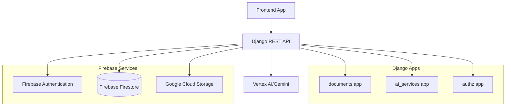

# Design Document

## Overview

The AteBit Legal Document AI Platform backend is designed as a Django REST Framework API that provides AI-powered legal document analysis capabilities. The system leverages Google Cloud services including Vertex AI for document analysis, Firebase for authentication, and Google Cloud Storage for file management.

The architecture follows Django best practices with clear separation of concerns across multiple apps: `documents` for document management, `ai_services` for AI integration, and `authz` for authentication. The system is designed to be stateless, scalable, and secure with proper error handling and logging.

## Architecture

### High-Level Architecture



### Request Flow

1. **Authentication**: Firebase ID token verification via existing middleware
2. **Document ID Consistency**: Frontend generates document ID, passed to backend, stored consistently across Firebase services
3. **Document Upload**: File processing, text extraction, and GCS storage using consistent document ID
4. **Firestore Storage**: Document metadata and analysis results stored in Firestore with same document ID
5. **AI Analysis**: Vertex AI processing for summarization, translation, key points, and risk analysis
6. **Response**: Structured JSON responses with analysis results
7. **Download**: Signed URL generation for document retrieval using consistent document ID

### Technology Stack

- **Framework**: Django 5.2 + Django REST Framework 3.16
- **Database**: Firebase Firestore (primary), SQLite (local development cache)
- **Authentication**: Firebase Authentication + Firebase Admin SDK
- **AI/ML**: Google Vertex AI (Gemini models)
- **Storage**: Google Cloud Storage
- **File Processing**: python-magic for MIME type detection
- **Testing**: pytest + pytest-django

## Components and Interfaces

### 1. Document Management (`apps/documents`)

#### Models (To Adapt for Firebase)
- **Document**: Core document metadata stored in Firestore (Django models as local cache/interface)
- **Analysis**: AI analysis results with versioning stored in Firestore
- **History**: Audit trail for document actions stored in Firestore

**Firebase Integration:**
- Primary data storage: Firebase Firestore
- Django models: Interface layer and local caching
- Document ID consistency: Frontend-generated UUID used across all Firebase services

#### Views and Serializers (To Implement)
```python
# Document CRUD operations
class DocumentViewSet(ModelViewSet):
    - POST /api/documents/ - Create document metadata (accepts document_id from frontend)
    - GET /api/documents/ - List user's documents
    - GET /api/documents/{id}/ - Retrieve document details (using consistent document_id)
    - DELETE /api/documents/{id}/ - Delete document

# Document processing
class DocumentUploadView(APIView):
    - POST /api/documents/{id}/upload/ - Upload file content (uses same document_id)

class DocumentAnalyzeView(APIView):
    - POST /api/documents/{id}/analyze/ - Trigger AI analysis (uses same document_id)

class DocumentDownloadView(APIView):
    - GET /api/documents/{id}/download/ - Get signed download URL (uses same document_id)
```

**Document ID Consistency Flow:**
1. Frontend generates unique document_id (UUID)
2. Frontend sends document_id in POST /api/documents/ request
3. Backend uses same document_id for:
   - Firestore document key
   - GCS storage path: `documents/{uid}/{document_id}/`
   - All subsequent API calls reference same document_id
4. Document ID remains consistent across all Firebase services

#### Serializers
```python
class DocumentSerializer(ModelSerializer):
    # Basic document metadata serialization

class DocumentUploadSerializer(Serializer):
    # File upload validation and processing

class AnalysisRequestSerializer(Serializer):
    # Analysis request parameters (target_language, etc.)

class AnalysisResultSerializer(ModelSerializer):
    # Structured analysis results output
```

### 2. AI Services (`apps/ai_services`)

#### Vertex AI Client (Partially Implemented)
The existing `vertex_client.py` needs enhancement for the prototype requirements:

```python
class VertexAIClient:
    # Existing methods to enhance:
    - analyze_document() - Support all analysis types
    - detect_language() - Language detection
    
    # New methods to implement:
    - summarize_document() - Plain language summaries
    - translate_content() - Multi-language translation
    - extract_key_points() - Party-specific key points
    - detect_risks() - Risk and clause analysis
```

#### Prompt Templates
```python
PROMPT_TEMPLATES = {
    'summarize': {
        'system': "Summarize this legal document in extremely simple language suitable for a 12-year-old...",
        'max_tokens': 5120
    },
    'translate': {
        'system': "Translate the following legal document summary to {target_language}...",
        'max_tokens': 7680
    },
    'key_points': {
        'system': "Extract 5-10 key points from this legal document. For each point, identify if it benefits the first party or opposing party...",
        'max_tokens': 2048
    },
    'risks': {
        'system': "Analyze this legal document for potentially risky or unusual clauses. Rate each risk as HIGH, MEDIUM, or LOW...",
        'max_tokens': 2048
    }
}
```

### 3. Authentication (`apps/authz`)

#### Firebase Integration (Already Implemented)
The existing `firebase_auth.py` provides:
- Firebase ID token verification
- User context setting (`request.user_uid`)
- DRF authentication class integration

#### Permission Classes (To Implement)
```python
class IsDocumentOwner(BasePermission):
    # Ensure users can only access their own documents
    
class IsAuthenticated(BasePermission):
    # Require valid Firebase authentication
```

### 4. File Processing and Storage

#### Google Cloud Storage Integration (To Implement)
```python
class GCSService:
    - upload_document() - Store original files using consistent document_id
    - generate_signed_url() - Create download URLs
    - delete_document() - Clean up storage
    
    # Storage paths (using consistent document_id):
    # documents/{uid}/{document_id}/original.{ext}
    # documents/{uid}/{document_id}/extracted.txt
```

#### Firebase Firestore Integration (To Implement)
```python
class FirestoreService:
    - create_document() - Store document metadata with frontend-provided document_id
    - get_document() - Retrieve document by document_id
    - update_document() - Update document status and metadata
    - store_analysis() - Store AI analysis results
    - get_analysis() - Retrieve analysis results
    
    # Firestore collections:
    # documents/{document_id} - Document metadata
    # documents/{document_id}/analyses/{version} - Analysis results
    # documents/{document_id}/history/{timestamp} - Action history
```

#### Text Extraction (To Implement)
```python
class TextExtractor:
    - extract_from_pdf() - PDF text extraction
    - extract_from_docx() - Word document processing
    - extract_from_txt() - Plain text handling
    - detect_encoding() - Character encoding detection
```

## Data Models

### Firebase Firestore Schema

#### Document Collection: `documents/{document_id}`
```json
{
  "document_id": "uuid-from-frontend",
  "title": "Contract Agreement",
  "owner_uid": "firebase-user-uid",
  "file_type": "application/pdf",
  "storage_path": "documents/{uid}/{document_id}/original.pdf",
  "extracted_text": "Full document text...",
  "language_code": "en",
  "status": "ANALYZED",
  "created_at": "2024-01-01T00:00:00Z",
  "updated_at": "2024-01-01T00:00:00Z"
}
```

#### Analysis Subcollection: `documents/{document_id}/analyses/{version}`
```json
{
  "version": 1,
  "target_language": "es",
  "summary": {
    "en": "This is a rental agreement...",
    "es": "Este es un acuerdo de alquiler..."
  },
  "key_points": [...],
  "risk_alerts": [...],
  "token_usage": {
    "input_tokens": 1500,
    "output_tokens": 200
  },
  "completion_time": "2024-01-01T00:00:00Z"
}
```

#### History Subcollection: `documents/{document_id}/history/{timestamp}`
```json
{
  "action": "ANALYZED",
  "actor_uid": "firebase-user-uid",
  "version": 1,
  "payload": {},
  "timestamp": "2024-01-01T00:00:00Z"
}
```

### Django Models (Interface Layer)
Django models serve as interface layer and local cache for Firestore data:

```python
class Document(models.Model):
    # Same fields as before, but document_id is primary key
    document_id = CharField(primary_key=True, max_length=36)  # UUID from frontend
    title = CharField(max_length=255)
    owner_uid = CharField(max_length=128, db_index=True)
    # ... other fields remain the same
```

### JSON Schema Examples

#### Summary Response
```json
{
  "detected_language": "en",
  "target_language": "es",
  "summary": {
    "en": "This is a simple rental agreement...",
    "es": "Este es un acuerdo de alquiler simple..."
  },
  "confidence": 0.95,
  "token_usage": {
    "input_tokens": 1500,
    "output_tokens": 200
  }
}
```

#### Key Points Response
```json
{
  "key_points": [
    {
      "text": "Monthly rent is $1,200",
      "explanation": "The tenant must pay this amount every month",
      "party_benefit": "opposing_party",
      "citation": "chars:150-180"
    },
    {
      "text": "Security deposit refundable",
      "explanation": "Tenant gets deposit back if no damages",
      "party_benefit": "first_party",
      "citation": "chars:300-350"
    }
  ]
}
```

#### Risk Analysis Response
```json
{
  "risks": [
    {
      "severity": "HIGH",
      "clause": "Landlord may enter without notice",
      "rationale": "This violates tenant privacy rights in most jurisdictions",
      "location": "chars:500-550"
    },
    {
      "severity": "MEDIUM", 
      "clause": "No pets allowed",
      "rationale": "Standard clause but may limit tenant options",
      "location": "chars:600-620"
    }
  ]
}
```

## Error Handling

### Error Response Format
```json
{
  "error": {
    "code": "VERTEX_AI_ERROR",
    "message": "AI analysis temporarily unavailable",
    "correlation_id": "req_123456789",
    "details": {}
  }
}
```

### Error Categories
- **Authentication Errors**: 401 Unauthorized, 403 Forbidden
- **Validation Errors**: 400 Bad Request with field details
- **Service Errors**: 503 Service Unavailable for AI/GCS failures
- **Not Found Errors**: 404 for missing documents
- **Server Errors**: 500 Internal Server Error with correlation IDs

### Retry Logic
- Vertex AI calls: 3 retries with exponential backoff
- GCS operations: 2 retries with linear backoff
- Database operations: No retries (fail fast)

## Testing Strategy

### Unit Tests
```python
# Test categories to implement:
- Document model operations
- Firebase authentication flow
- Vertex AI client methods
- GCS service operations
- Serializer validation
- Permission classes
```

### Integration Tests
```python
# API endpoint tests:
- Document upload flow
- Analysis request/response
- Download URL generation
- Authentication enforcement
- Error handling scenarios
```

### Mock Strategy
```python
# Mock external services:
- Firebase Admin SDK
- Vertex AI client
- Google Cloud Storage
- File processing operations
```

## API Endpoints

### Document Management
```
POST   /api/documents/                    # Create document
GET    /api/documents/                    # List documents
GET    /api/documents/{id}/               # Get document details
DELETE /api/documents/{id}/               # Delete document
POST   /api/documents/{id}/upload/        # Upload file
GET    /api/documents/{id}/download/      # Download file
```

### Analysis Operations
```
POST   /api/documents/{id}/analyze/       # Trigger analysis
GET    /api/documents/{id}/analysis/      # Get latest analysis
GET    /api/documents/{id}/analysis/{v}/  # Get specific version
```

### System Endpoints
```
GET    /api/health/                       # Health check
GET    /api/version/                      # Version info
```

## Security Considerations

### Authentication
- Firebase ID token verification on all endpoints
- Token caching with appropriate TTL
- Graceful handling of expired tokens

### Authorization
- Document ownership validation
- User isolation (owner_uid scoping)
- No cross-user data access

### Data Protection
- No sensitive document text in logs
- Secure file upload validation
- MIME type verification
- File size limits (10MB)

### API Security
- CORS configuration for frontend
- Rate limiting considerations
- Input validation and sanitization
- SQL injection prevention (Django ORM)

## Performance Considerations

### Database Optimization
- Indexes on owner_uid and updated_at
- JSON field indexing for analysis results
- Query optimization for document lists

### Caching Strategy
- Firebase public key caching
- Analysis result caching (optional)
- GCS signed URL caching

### Async Processing
- File upload processing
- Text extraction operations
- AI analysis requests (future enhancement)

### Resource Management
- File size limits
- Token usage tracking
- Request timeout handling
- Memory management for large files